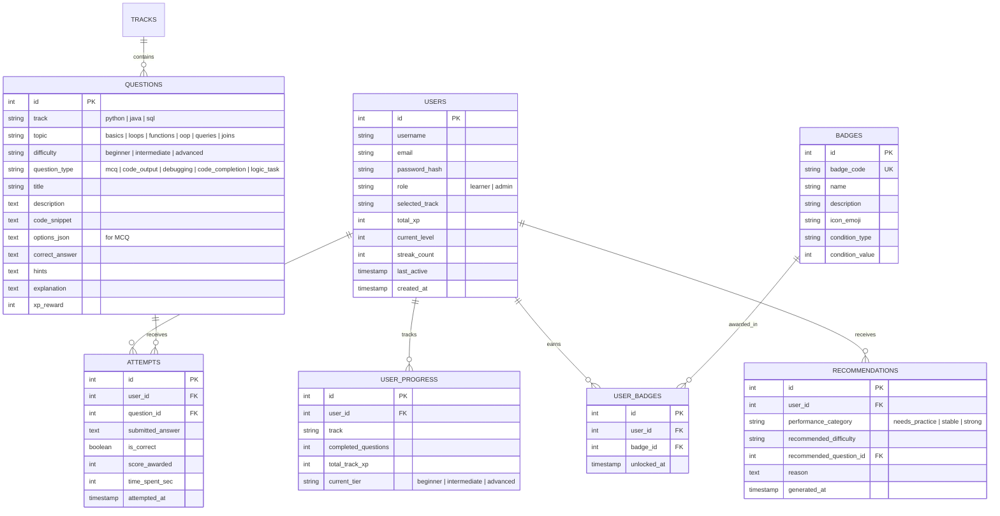
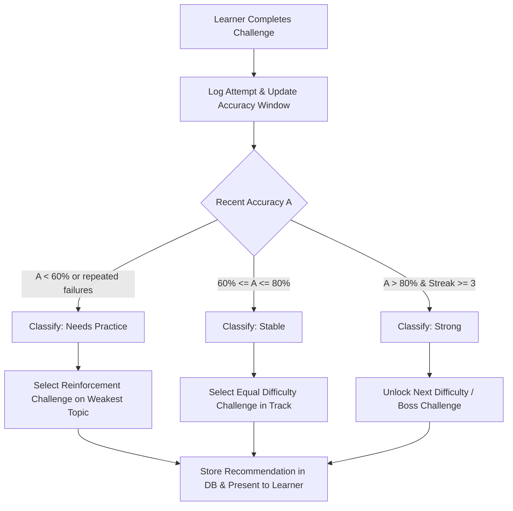

# Implementation Plan: CodeQuest – Interactive Game-Based Platform for Programming Learning

**Project**: CodeQuest (MSc CS Capstone Project)  
**Academic Guideline**: [CodeQuest_MSc_Synopsis.pdf](file:///d:/ML%20Projects/antigravity/game_app/CodeQuest_MSc_Synopsis.pdf)  
**Tech Stack**: 100% Free, Local-First, Zero-Subscription (Python Flask + SQLite + HTML5/CSS3/JS + Chart.js + Prism.js + Web Audio API)

---

## 1. Goal Description

Develop a production-grade, interactive, game-based learning platform for computer programming aligned with the MSc Computer Science curriculum synopsis. The platform gamifies learning across **Python**, **Java**, and **SQL** through progressive difficulty levels, points/XP, badges, streaks, leaderboards, and an intelligent **Adaptive Learning Recommendation Engine** that tailors challenges based on learner performance analytics. An integrated **Administration Console** provides content, difficulty, and user management.

---

## 2. Free Technology Stack Architecture

All tools, frameworks, and libraries are **100% free, open-source, and offline/local-friendly**:

```
+-----------------------------------------------------------------------------------+
|                            CLIENT BROWSER (UI/UX)                                 |
|  - Cyberpunk/Fantasy Game Theme (Neon Cyan/Purple/Amber, Glassmorphism, SFX)       |
|  - HTML5 Canvas & Web Audio API (Synthesized 8-bit/quest sound effects - $0)       |
|  - Chart.js (CDN, free) for Learning Analytics & Skill Radar                      |
|  - Prism.js (CDN, free) for Syntax Highlighting in Python, Java, SQL              |
+-----------------------------------------+-----------------------------------------+
                                          | REST API / Form Submissions
+-----------------------------------------v-----------------------------------------+
|                         BACKEND SERVICE (Python 3.11)                             |
|  - Flask (Microframework, lightweight, fast, 100% free)                           |
|  - Werkzeug (Secure password hashing via scrypt/pbkdf2)                            |
|  - Adaptive Recommendation Engine (Proficiency matrix & state machine)            |
|  - Challenge Validation & Sandbox Engine (In-memory SQLite & Safe Code Evaluation)|
+-----------------------------------------+-----------------------------------------+
                                          | SQL queries / ORM
+-----------------------------------------v-----------------------------------------+
|                       DATABASE LAYER (SQLite 3)                                   |
|  - File-based `codequest.db` (Zero installation, zero cost, completely portable)   |
|  - Full relational schema: Users, Tracks, Questions, Attempts, Progress, Badges   |
+-----------------------------------------------------------------------------------+
```

---

## 3. Database Schema (Main Entities)

The schema implements the entities specified in Section 12 of the synopsis:



---

## 4. Adaptive Learning & Recommendation Engine (MSc Core)

Alinged with Section 11 of the synopsis, the system uses an analytical decision model:

1. **Input Metrics**:
   - $A$: Recent accuracy rate over the last $N=5$ attempts ($A \in [0.0, 1.0]$)
   - $R$: First-try success rate ($R \in [0.0, 1.0]$)
   - $S$: Current streak length
   - $T$: Topic-specific proficiency score ($P_{\text{topic}} \in [0.0, 100.0]$)

2. **Classification Logic**:
   - **Needs Practice** ($A < 0.60$ or consecutive errors $\ge 2$):
     - Identify the specific weak topic with lowest $P_{\text{topic}}$.
     - Recommend reinforcement challenge: lower difficulty or remedial debugging task with scaffolded hints.
   - **Stable** ($0.60 \le A \le 0.80$):
     - Keep learner in current tier; present challenge on adjacent unmastered topics.
   - **Strong / Master** ($A > 0.80$ and $S \ge 3$):
     - Promote learner to next difficulty tier (e.g., Beginner $\to$ Intermediate $\to$ Advanced) or unlock Boss Challenge.



---

## 5. Game Mechanics & Gamification Features

- **XP & Level Scaling**:
  - Beginner Challenge: 50 XP
  - Intermediate Challenge: 100 XP
  - Advanced / Boss Challenge: 200 XP
  - Bonus XP: +15 for 0-hint solve, +10 for fast completion (< 30s)
  - Levels: Level $L$ requires $100 \times L^{1.5}$ XP (Level 1: Novice $\to$ Level 10: Grandmaster Code Knight).
- **Badges System**:
  - 🔰 **First Code**: Complete your first challenge
  - 🐍 **Python Apprentice**: Complete 5 Python challenges
  - ☕ **Java Squire**: Complete 5 Java challenges
  - 🗄️ **Query Master**: Complete 5 SQL challenges
  - 🐛 **Bug Hunter**: Solve 5 debugging challenges
  - ⚡ **Speed Coder**: Solve a challenge in under 20 seconds
  - 🔥 **Streak Knight**: Achieve a 5-challenge correct streak
  - 🏆 **Track Champion**: Complete all levels in any track
  - 🧙‍♂️ **Polyglot**: Solve challenges in all 3 tracks
- **Interactive Leaderboard**:
  - Global Ranking & Track-Specific Rankings (Python, Java, SQL).
- **Sound Effects (Web Audio API)**:
  - Zero-file procedural sound synthesizer (correct chime, level up fanfare, error thud, click sound) with an instant Mute/Unmute toggle.

---

## 6. Challenge Types & Interactive Sandbox

1. **Multiple Choice Questions (MCQ)**: Instant option validation with rich code snippet formatting.
2. **Code-Output Prediction**: Learner predicts exact console output for tricky code snippets (evaluating execution flow).
3. **Debugging Tasks**: Buggy code snippet is provided; learner identifies the broken line or edits the fix.
4. **Code-Completion**: Fill-in-the-blank tokens (e.g., missing keyword, syntax, parameter) to make the code operational.
5. **Logic/SQL Execution Arena**:
   - **SQL Live Runner**: Executes user SQL query in a sandboxed, ephemeral in-memory SQLite database preloaded with sample data (`employees`, `orders`, `students`) and compares output table with expected result.
   - **Python Logic Validator**: Validates logic against automated test cases safely.

---

## 7. Proposed File Structure

```
d:\ML Projects\antigravity\game_app\
├── app.py                      # Flask Application entry point & route definitions
├── config.py                   # App configuration & secret keys
├── database.py                 # SQLite connection helpers & schema initializers
├── seed_data.py                # Preloaded rich question bank (Python, Java, SQL, all 5 types)
├── models.py                   # Data access layer & business logic
├── adaptive_engine.py          # MSc recommendation model & performance classifier
├── code_runner.py              # Safe SQL & logic evaluation sandbox
├── requirements.txt            # Minimal free dependencies (flask, werkzeug)
├── static/
│   ├── css/
│   │   ├── style.css           # Cyberpunk/RPG game design system & responsive layout
│   │   └── prism.min.css       # Syntax highlighting stylesheet
│   ├── js/
│   │   ├── game_audio.js       # Web Audio API synthesizer for SFX
│   │   ├── quest_engine.js     # Challenge submission, feedback modal, XP animations
│   │   ├── analytics_charts.js # Chart.js visualizations for accuracy/weak topics
│   │   └── prism.min.js        # Prism syntax highlighter
│   └── icons/                  # SVG game badges & UI icons
└── templates/
    ├── base.html               # Master layout with game navbar, XP bar, audio toggle
    ├── index.html              # Landing page with hero & track overview
    ├── login.html              # Cyberpunk login portal
    ├── register.html           # Character/Learner creation
    ├── dashboard.html          # Quest map, active track, daily streak, recommendation banner
    ├── tracks.html             # Track selector (Python, Java, SQL)
    ├── challenge.html          # Interactive Challenge Arena (Code editor/MCQ/Output/Runner)
    ├── leaderboard.html        # Global & Track leaderboards
    ├── profile.html            # User statistics, badges showcase, accuracy breakdown
    ├── analytics.html          # In-depth MSc performance report & weakness diagnosis
    └── admin/
        ├── admin_dashboard.html# Content & platform metrics
        ├── question_form.html  # CRUD question editor with live preview
        └── users.html          # User progress manager
```

---

## 8. Verification & Demonstration Plan

### Automated Tests
1. **Database Schema & Seed Test**: Run initialization script to verify table creation and 30+ preloaded curated challenges across all tracks and types.
2. **Adaptive Recommendation Unit Test**: Test mathematical state machine with simulated learner sessions (failing learner, improving learner, high-streak learner).
3. **Sandbox Test**: Test in-memory SQL execution and output comparison.

### Manual & Interactive Verification
1. Register new learner account and test track selection.
2. Complete questions across all 5 types: MCQ, Code-Output, Debugging, Code-Completion, and SQL runner.
3. Verify XP award, level-up celebration, and badge unlocking.
4. Verify Adaptive Engine: deliberately miss answers $\to$ check if platform recommends targeted remedial challenge on the weak topic.
5. Verify Admin Portal: log in as admin, create a new challenge, verify it appears in the learner's quest queue.
6. Verify Leaderboard updates live as XP is earned.

---

## 9. Open Questions & Alignment with User

> [!NOTE]
> All chosen technologies are 100% free, run locally without any API keys, paid services, or complex configurations.

Please review the proposed plan:
- Would you like any additional programming tracks added beyond **Python**, **Java**, and **SQL**?
- Would you like sample pre-configured accounts (e.g. `admin / admin123` and `learner / learner123`) seeded automatically for instant testing during project defense/presentation?
